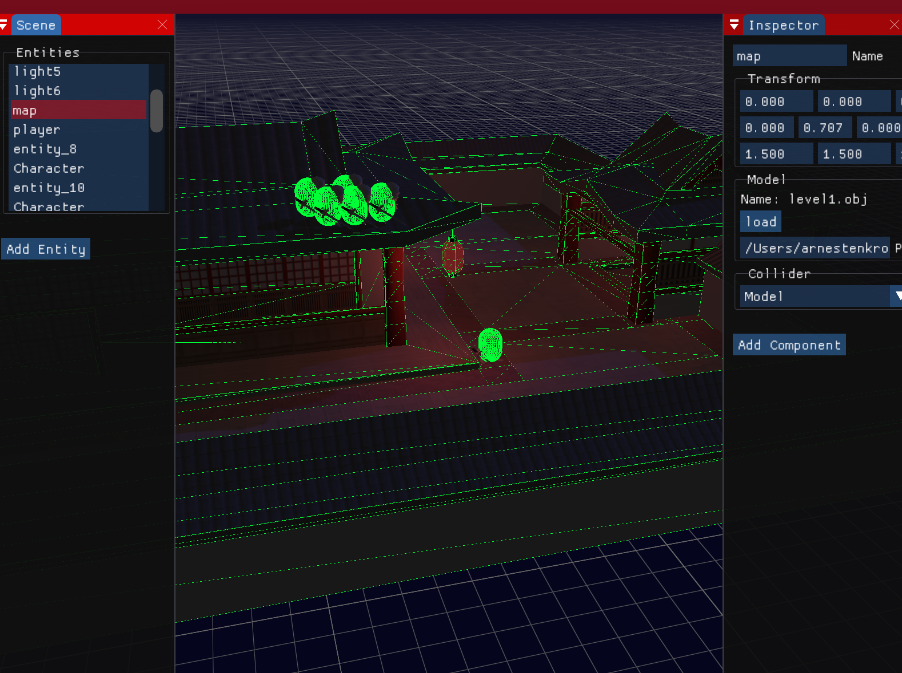

## Prototype 2
Prototype 2 is a simple game engine. It is a successor to [Prototype](https://github.com/ArneStenkrona/Prototype).
It is developed only as a learning experience. Therefore there is nothing to expect in terms of usability. I keep it hosted open source just to document its progress.



## Dependencies
[CMake]()  
[Vulkan](https://vulkan.lunarg.com/sdk/home)  
[Catch2](https://github.com/catchorg/Catch2/)  
[glfw3 3.3](https://www.glfw.org)  
[glm](https://glm.g-truc.net/0.9.9/index.html)
[zlib](https://www.zlib.net)
[assimp](https://www.assimp.org)

## Setting up Vulkan
* Download [VulkanSDK](https://vulkan.lunarg.com/sdk/home)

### Linux/Windows
While Linux and Windows compatibility is intended, I have not attempted to build this project on those platforms yet.
Hopefully installing the dependencies and running cmake should be sufficient.

### MacOS
MacOS does not actually natively support Vulkan. However KhronosGroup has provided MoltenVK, an implementation of Vulkan that translates Vulkan calls to Metal, Apple's graphics API. As such, we require a bit of extra work to get Vulkan working on Mac.

* Make sure you've downloaded the MacOS version of the VulkanSDK
* Add Vulkan to your environment variables.
```
 $ echo "export VK_ICD_FILENAMES=[YOUR PATH TO VULKAN HERE]/macOS/etc/vulkan/icd.d/MoltenVK_icd.json" >> ~/.profile
 $ echo "export VULKAN_SDK=[YOUR PATH TO VULKAN HERE]/macOS/" >> ~/.profile
 $ echo "export VK_LAYER_PATH=[YOUR PATH TO VULKAN HERE]/macOS/etc/vulkan/explicit_layer.d" >> ~/.profile
```
If you are not using *~/.profile* as your shell profile you should change *~/.profile* to the path of your preferred shell profile.
## Setting up Catch2
* Install Catch2 from its git repository using CMake
```
$ git clone https://github.com/catchorg/Catch2.git
$ cd Catch2
$ cmake -Bbuild -H. -DBUILD_TESTING=OFF
$ sudo cmake --build build/ --target install
```
[Further info](https://github.com/catchorg/Catch2/blob/master/docs/cmake-integration.md#installing-catch2-from-git-repository)

## Building

* Building requires CMake version 3.14.4 or later

* Make sure you are in the root directory
```
$ cd [YOUR PATH TO prototype2]
```

* Then run the following
```
$ cmake -H. -Bbuild
$ cmake --build build -- -j3
```

This will build both prototype as an executable, "prototype2" and
as a library "prototype2.lib". It will also build the test executable,
"prototype2_test".

## Testing
Testing is done with Catch2. Simply run "prototype2_tests".

## Authors

* **Arne Stenkrona**
